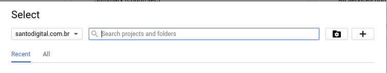
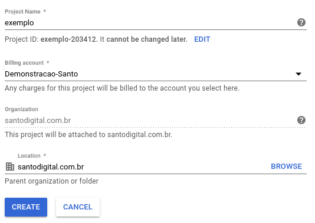
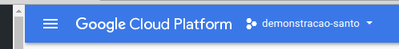
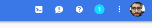

Exemplo de Api PHP utilizando SLIM + Docker
---

Esse exemplo visa como podemos desenvolver uma api PHP utilizando Google Cloud App Engine. 
Você vai perceber como é simples fazer o deploy de uma aplicação.

Configurando seu projeto
---

Entre no console do Google Cloud Platform com o link [https://console.cloud.google.com](https://console.cloud.google.com). Nesse endereço será necessário que crie seu projeto ou utilize algum projeto que você já possui.





Selecione o Projeto criado.



Entre no Coud Shell através do ícone:



Faça o clone no git
---

```
git clone https://github.com/carlosrgomes/api-php-docker.git
cd api-php-docker
gcloud app deploy

```

Quando fizer o deploy e for o primeiro a ser realizado no projeto, você precisa escolher a região do GCP que vai ficar
hospedado seu App Engine. Conforme pode observar abaixo:

```
WARNING: Creating an App Engine application for a project is irreversible and the region
cannot be changed. More information about regions is at
<https://cloud.google.com/appengine/docs/locations>.

Please choose the region where you want your App Engine application
located:

 [1] europe-west2  (supports standard and flexible)
 [2] us-east1      (supports standard and flexible)
 [3] us-east4      (supports standard and flexible)
 [4] asia-northeast1 (supports standard and flexible)
 [5] asia-south1   (supports standard and flexible)
 [6] australia-southeast1 (supports standard and flexible)
 [7] southamerica-east1 (supports standard and flexible)
 [8] northamerica-northeast1 (supports standard and flexible)
 [9] us-central    (supports standard and flexible)
 [10] europe-west3  (supports standard and flexible)
 [11] europe-west   (supports standard and flexible)
 [12] cancel
Please enter your numeric choice:  7

```
Vou selecionar a região do Brasil número 7. Log após vai aparecer a mensagem que o App Engine está criando sua aplicação.
E vai mostrar um resumo das configurações de sua app:

```
Creating App Engine application in project [exemplo-203412] and region [southamerica-east1]....done.
Services to deploy:

descriptor:      [/home/carlos_barbero/api-php-docker/app.yaml]
source:          [/home/carlos_barbero/api-php-docker]
target project:  [exemplo-203412]
target service:  [default]
target version:  [20180507t102345]
target url:      [https://exemplo-203412.appspot.com]


Do you want to continue (Y/n)?
```

Digite Y e tecle enter.
Na tag url será o endereço disponibilizado para sua aplicação.
Ao final do processo será exibido a mensagem:

```
Beginning deployment of service [default]...
Some files were skipped. Pass `--verbosity=info` to see which ones.
You may also view the gcloud log file, found at
[/tmp/tmp.tawjXQ3mSE/logs/2018.05.07/10.27.45.995665.log].
╔════════════════════════════════════════════════════════════╗
╠═ Uploading 5 files to Google Cloud Storage                ═╣
╚════════════════════════════════════════════════════════════╝
File upload done.
Updating service [default]...done.
Setting traffic split for service [default]...done.
Deployed service [default] to [https://exemplo-203412.appspot.com]

You can stream logs from the command line by running:
  $ gcloud app logs tail -s default

To view your application in the web browser run:
  $ gcloud app browse
```


